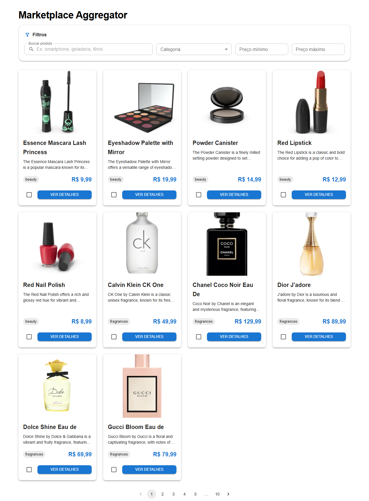
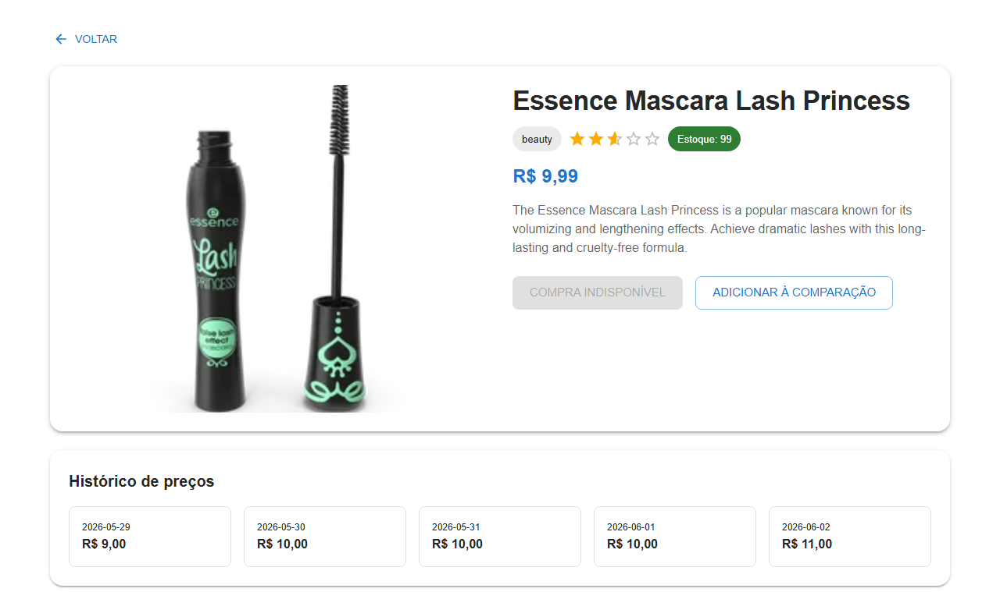
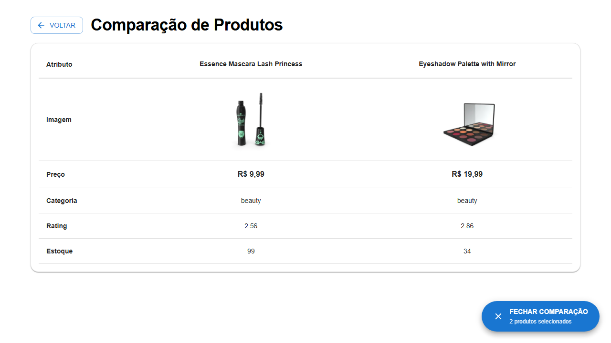
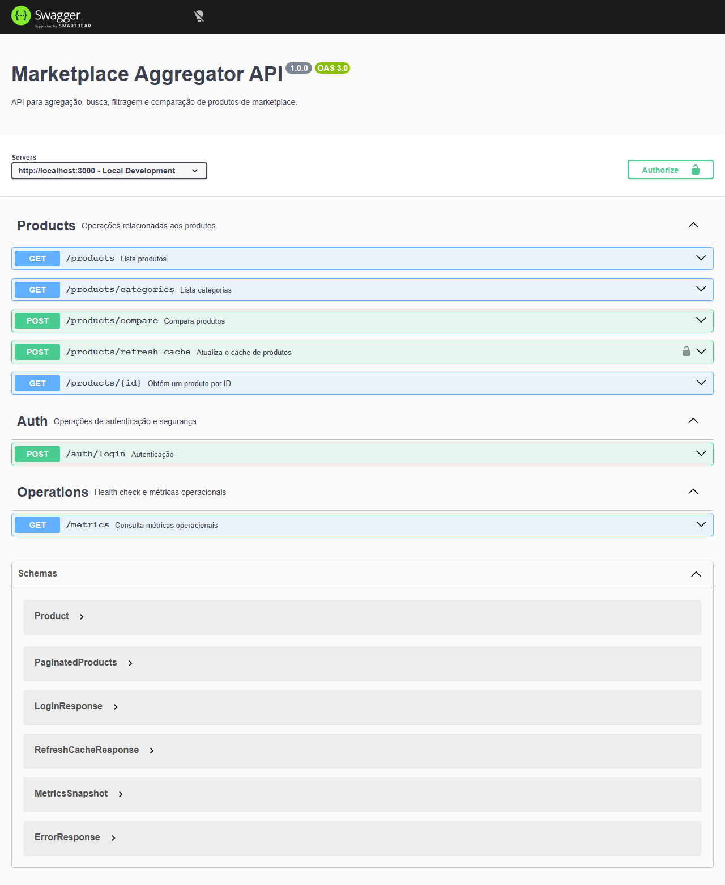

# Marketplace Aggregator

Solução fullstack para o Case Técnico de Desenvolvedor(a) Fullstack Sênior da Webcontinental.


[](https://coveralls.io/github/VINICIUS0226/marketplace-aggregator?branch=master)

## Visão Geral

O Marketplace Aggregator consolida produtos vindos de uma fonte externa, expõe esses dados por uma API REST e oferece uma interface web para listagem, busca, filtros, detalhes e comparação lado a lado.

O desafio pedia qualidade sobre quantidade. Por isso, a solução prioriza arquitetura em camadas, clareza de código, documentação, testes e execução simples com Docker.

## Premissas do Case

- O agregador opera sobre uma coleção pequena o suficiente para ser mantida em memória.
- A DummyJSON representa a integração externa com marketplaces para fins de avaliação técnica.
- A paginação e os filtros são aplicados pela API local após a ingestão dos produtos.
- O histórico de preços é sintético e demonstrativo, pois não existe persistência temporal no escopo atual.
- A autenticação JWT protege uma operação administrativa, mas não representa um sistema completo de usuários.

## Funcionalidades

Core obrigatório:

- Ingestão de produtos a partir da API pública DummyJSON.
- Modelagem em memória com produtos, categorias, atributos, estoque, preço e histórico sintético de preço.
- API REST para listar produtos com paginação, filtrar por categoria, faixa de preço e busca textual.
- Endpoint para obter detalhe de produto.
- Frontend com listagem, filtros, busca e detalhe.
- Seleção de 2 ou mais produtos para comparação lado a lado.

Diferenciais implementados:

- Autenticação JWT para rota sensível de atualização do cache.
- Testes automatizados no backend e frontend.
- Docker Compose para subir backend e frontend com um comando.
- Histórico sintético de preços por produto, exibido na tela de detalhe.
- Cache em memória, timeout e tratamento de falhas na integração externa.
- Rate limiting, CORS e Helmet.
- Documentação Swagger/OpenAPI.
- Testes E2E com Playwright.
- Pipeline de CI no GitHub Actions.
- Cobertura agregada de backend e frontend publicada no Coveralls.
- Lazy loading por rota para reduzir o bundle inicial do frontend.
- Validação declarativa de entrada com Zod.
- Retry com backoff antes do fallback para o último snapshot válido.
- Logs estruturados em JSON e métricas operacionais da integração externa.

## Stack

Backend:

- Node.js 20
- Express
- TypeScript
- Axios
- Node Cache
- Zod
- Swagger/OpenAPI
- Jest e Supertest

Frontend:

- React 18
- Vite
- TypeScript
- Material UI
- React Router
- TanStack React Query
- Axios
- Context API
- Vitest e Testing Library
- Playwright

Infraestrutura:

- Docker
- Docker Compose
- GitHub Actions

## Fonte de Dados

A aplicação consome produtos da API pública DummyJSON:

```text
https://dummyjson.com/products?limit=100
```

A escolha foi feita por ser uma fonte pública, estável para o escopo do case, sem autenticação obrigatória e com dados suficientes para categorias, preço, estoque, imagens e atributos de produto.

Os dados são mantidos em memória e cacheados no backend. Não foi usado banco de dados porque o enunciado permite dados in-memory e a prioridade foi demonstrar modelagem, arquitetura e integração externa.

## Arquitetura

O backend segue separação em camadas:

```text
Routes -> Controllers -> Services -> Repositories -> External API
```

Responsabilidades:

- Routes: definem os endpoints e middlewares.
- Controllers: recebem requisições HTTP, validam entradas básicas e retornam respostas.
- Services: concentram regras de negócio, filtros, paginação e comparação.
- Repositories: integram com a fonte externa e controlam cache.

O frontend separa rotas, páginas, componentes, hooks, contexto de comparação, tema e cliente HTTP.

### Fluxo de Ingestão

```text
GET /products
  -> ProductController
  -> ProductService
  -> ProductRepository
  -> cache em memória
  -> DummyJSON em caso de cache miss
```

O repository aplica timeout de 15 segundos, três tentativas com backoff progressivo e normalização do payload recebido antes de disponibilizá-lo às outras camadas.

## Clonar o Repositório

```bash
git clone https://github.com/VINICIUS0226/marketplace-aggregator.git
cd marketplace-aggregator
```

Repositório público:

```text
https://github.com/VINICIUS0226/marketplace-aggregator
```

## Como Rodar com Docker

Pré-requisitos:

- Docker
- Docker Compose

Na raiz do projeto:

```bash
docker compose up --build
```

Serviços:

| Serviço | URL |
| --- | --- |
| Frontend | http://localhost:5173 |
| Backend | http://localhost:3000 |
| Swagger | http://localhost:3000/api-docs |
| Health Check | http://localhost:3000/health |
| Métricas | http://localhost:3000/metrics |

Para parar:

```bash
docker compose down
```

### Docker em Produção

O repositório também inclui uma composição simplificada de produção. Ela usa o
build compilado do backend e serve o frontend estático com Nginx:

```bash
docker compose -f docker-compose.prod.yml up --build -d
```

Em um ambiente real, injete um segredo próprio:

```bash
AUTH_SECRET=um-segredo-forte docker compose -f docker-compose.prod.yml up --build -d
```

O Nginx está configurado com fallback para `index.html`, permitindo acesso
direto às rotas do React Router.

## Como Rodar Localmente

Backend:

```bash
cd backend
npm install
npm run dev
```

Frontend:

```bash
cd frontend
npm install
npm run dev
```

URLs locais:

- Frontend: http://localhost:5173
- Backend: http://localhost:3000

## Variáveis de Ambiente

Backend:

```env
PORT=3000
AUTH_SECRET=marketplace-secret
CORS_ORIGINS=http://localhost
PRODUCTS_API_URL=https://dummyjson.com/products?limit=100
```

`CORS_ORIGINS` é opcional e aceita uma lista separada por vírgulas para
ambientes adicionais.

`PRODUCTS_API_URL` também é opcional. Ela permite substituir a DummyJSON sem
alterar código e é usada pelo E2E de resiliência com uma fonte controlada.

Frontend:

```env
VITE_API_URL=http://127.0.0.1:3000
```

No Docker Compose, o valor usado pelo frontend é:

```env
VITE_API_URL=http://localhost:3000
```

Esse valor aponta para `localhost` porque a chamada é feita pelo browser do usuário, não de dentro do container.

## Endpoints da API

### Health Check

```http
GET /health
```

### Métricas Operacionais

```http
GET /metrics
```

Expõe contadores em memória para requisições, sucessos, falhas, retries e uso do snapshot stale da integração externa.

### Autenticação

```http
POST /auth/login
```

Body:

```json
{
  "username": "admin",
  "password": "admin123"
}
```

Resposta:

```json
{
  "token": "jwt-token"
}
```

### Listar Produtos

```http
GET /products
```

Query params:

| Parâmetro | Tipo | Descrição |
| --- | --- | --- |
| page | number | Página atual, inteiro positivo |
| limit | number | Itens por página, inteiro positivo entre 1 e 100 |
| search | string | Busca textual por título, descrição ou categoria |
| category | string | Filtro por categoria |
| minPrice | number | Preço mínimo não negativo |
| maxPrice | number | Preço máximo não negativo e maior ou igual ao mínimo |

Exemplos:

```http
GET /products?page=1&limit=10
GET /products?search=iphone
GET /products?category=smartphones
GET /products?minPrice=100&maxPrice=500
```

### Detalhar Produto

```http
GET /products/:id
```

### Listar Categorias

```http
GET /products/categories
```

### Comparar Produtos

```http
POST /products/compare
```

Body:

```json
{
  "ids": [1, 2, 3]
}
```

`ids` exige ao menos dois inteiros positivos e não permite duplicação.

### Atualizar Cache

Rota protegida por JWT:

```http
POST /products/refresh-cache
Authorization: Bearer <token>
```

## Testes

Backend:

```bash
cd backend
npm test
```

Frontend:

```bash
cd frontend
npm test
```

Build do frontend:

```bash
cd frontend
npm run build
```

E2E:

```bash
cd frontend
npm run e2e:install
npm run test:e2e
```

O Playwright reaproveita servidores já ativos em `localhost:3000` e `localhost:4173` quando estiver rodando localmente. Isso evita conflito com o Docker durante validações manuais.

### Validação Executada

Antes da entrega, foram executados localmente:

```bash
cd backend && npm test
cd frontend && npm test
cd frontend && npm run build
cd frontend && npm run test:e2e
docker compose up -d --build
```

Resultados observados:

- `32/32` testes automatizados do backend aprovados.
- `15/15` testes unitários e de componente do frontend aprovados.
- `6/6` testes E2E aprovados: listagem, detalhe, comparação, autenticação, fallback resiliente e geração das evidências visuais.
- Build do frontend aprovado.
- Cobertura mínima protegida por thresholds no Jest e Vitest.
- Backend saudável via `GET /health`.
- Frontend acessível em `http://localhost:5173`.
- Pipeline do GitHub Actions aprovado em `master`.

## CI

O workflow em `.github/workflows/ci.yml` executa:

- Instalação de dependências do backend.
- Testes do backend com coverage.
- Instalação de dependências do frontend.
- Testes do frontend com coverage.
- Instalação do Chromium para Playwright.
- Testes E2E.
- Build do frontend.
- Upload dos relatórios de coverage como artefatos.
- Upload dos relatórios para Coveralls com agregação das coberturas de backend e frontend.

## Decisões de Arquitetura

- Express foi escolhido por ser simples, direto e suficiente para uma API REST de escopo controlado.
- TypeScript foi usado em backend e frontend para reduzir erros de contrato e melhorar legibilidade.
- Dados em memória foram priorizados porque o enunciado não exige banco e a modelagem era mais importante que persistência.
- DummyJSON foi escolhido como fonte externa por ter produtos com dados ricos e boa disponibilidade.
- React Query foi usado para cache e gerenciamento de estados assíncronos no frontend.
- Context API foi suficiente para controlar os produtos selecionados para comparação.
- Swagger foi incluído para facilitar validação manual da API.
- Docker Compose foi configurado para desenvolvimento, com hot reload e um comando único de execução.

## Tratamento de Erros e Resiliência

- Timeout configurado na chamada externa.
- Três tentativas com backoff progressivo antes de recorrer ao fallback.
- Cache em memória para reduzir chamadas repetidas à DummyJSON.
- Fallback para o último snapshot válido quando a fonte externa falha após uma carga bem-sucedida.
- E2E controlado para validar o fallback sem depender de indisponibilidade real da DummyJSON.
- Validação do payload recebido antes de atualizar o cache.
- Validação declarativa das entradas HTTP com Zod.
- Middleware global de erro no backend.
- Respostas padronizadas para erros conhecidos.
- Logs estruturados em JSON e métricas operacionais expostas por `GET /metrics`.
- Health check para o Docker Compose.
- Rate limiting para reduzir abuso de requisições.
- Helmet e CORS para proteções HTTP básicas.

## Trade-offs

Itens não implementados de propósito:

- Banco de dados relacional.
- Persistência real do histórico de preços.
- Sistema de usuários completo.
- Deploy público.
- Mensageria ou fila para ingestão assíncrona.

Esses pontos aumentariam a complexidade sem serem necessários para cumprir o core do desafio. Em um cenário produtivo, os próximos passos seriam adicionar persistência, observabilidade distribuída, paginação delegada à fonte ou ao banco, e autenticação com usuários reais.

## Limitações Conhecidas

- O cache em memória é local ao processo e não é compartilhado entre instâncias.
- O fallback retorna erro quando a DummyJSON está indisponível e a instância ainda não possui snapshot válido.
- As credenciais de demonstração são fixas e existem apenas para evidenciar proteção de rota.
- O histórico de preços não é persistido entre reinicializações.
- A comparação é mantida no estado do browser e não sobrevive a refresh da página.

## Próximos Passos

- Persistir produtos e histórico de preços em PostgreSQL ou SQLite.
- Adicionar Redis para cache distribuído.
- Criar deploy público.
- Exportar métricas para Prometheus e adicionar tracing distribuído.

## Evidências Visuais

### Lista de Produtos



### Detalhe e Histórico de Preços



### Comparação de Produtos



### Swagger



## Autor

Vinícius Nuñez Lopes

GitHub: https://github.com/VINICIUS0226

LinkedIn: https://linkedin.com/in/vinicius-nunez-811245aa
